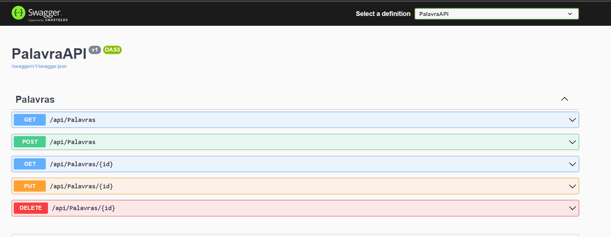
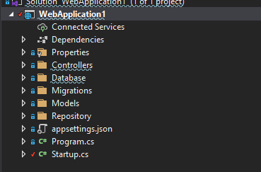

# ASPNET Core Web API REST WordsGame

Este projeto tem como foco o desenvolvimento de aplicações web utilizando o ASP.NET WEB API 5, através da utilização dos seus fundamentos e recursos disponíveis no framework. O objetivo principal é a elaboração de um estudo básico que proporcione um entendimento sólido sobre a tecnologia e suas principais características, além de capacitar o desenvolvedor a criar soluções web mais avançadas. Com o aprimoramento das habilidades técnicas e conhecimentos relacionados à programação web, é possível desenvolver projetos mais robustos e desafiadores. Dessa forma, este projeto é essencial para quem busca se atualizar no mercado de tecnologia e aprimorar sua carreira como desenvolvedor web.

<br />
<br />
serviços utilizadas:
CRUD Scaffolding</br>
Sql Server adaptation and migration</br>
Validation</br>
Asynchronous operations using Tasks (async, await)</br>
Implementing CRUD REST API</br>
Swagger</br>
Postman</br>
Entity Framework</br>


## 🖼 Screenshot das telas da aplicação <br/>
<p>Swagger</p>
<br/>
<br/>
<p>Projeto Pastas</p>
<br/>
<br/>

<br/>
## 🚀 Tecnologias utilizadas <br/>
<br/>
- C#  asp net Core Web API<br/>
- Sql Server <br/>
- html e css e um pouco de Javascript <br/>
<br/>

## 🚀 Como usar <br/>

```bash
# no arquivo WebApplication1/appsettings.json, na linha:
    "DefaultConnection": "Server=localhost;Database=PalavraAPI;Uid=xx;Pwd=xx;";
     terá que mudar para o Servidor do seu SqlServer ";
# Entrar numa IDE de sua preferência 


```


## Linkedin abaixo

<h4 align="center">
   Feito com Por   <a href="https://www.linkedin.com/in/luiz-carlos-b50693173/" target="_blank"> Luiz Carlos </a>
</h4>

</html>
